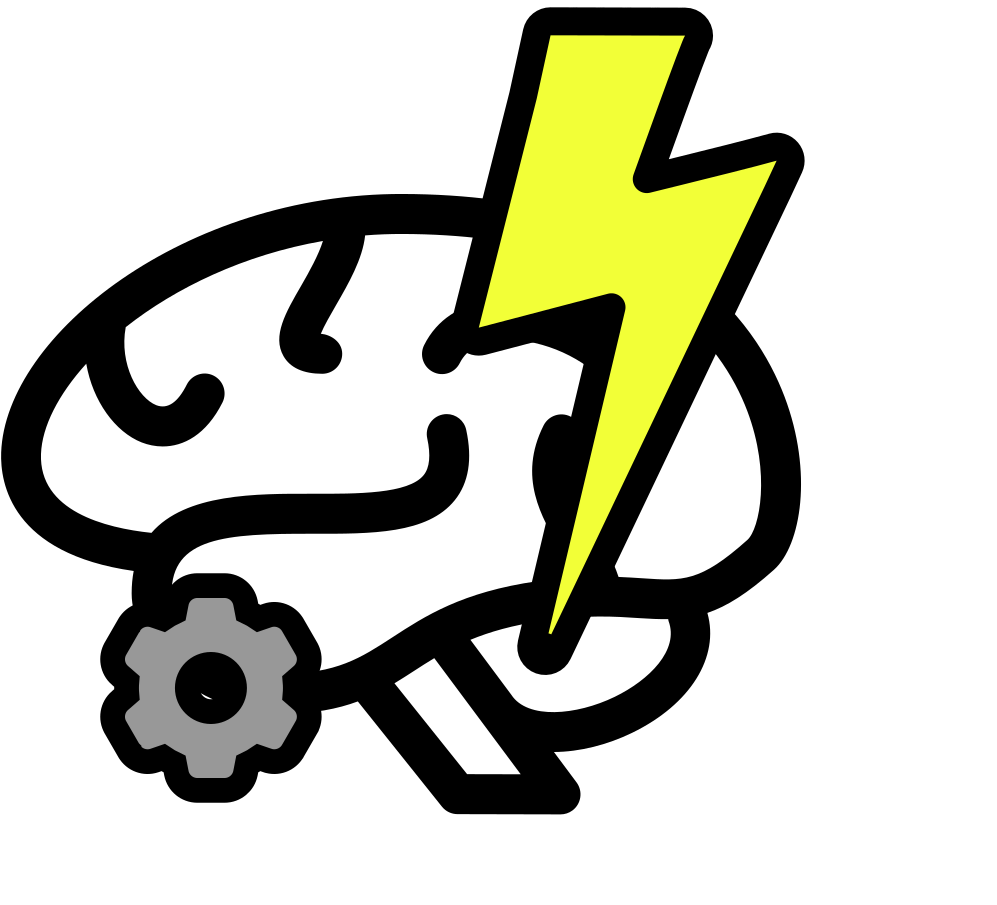

# [Nobrainstorm: The Only Whiteboard You Need](https://www.nobrainstorm.tech/)



- [36 hours left] Alright, let’s begin this hackathon with a winning spirit!!!  
- [24 hours left] What do we do?  
- [12 hours left] *What do we do?*  
- [10 hours left] Hey, (insert AI chatbot), WHAT do we do in a hackathon?

Fearing the deadline approaching quickly, we could not, for the life of us, come up with a project we all wanted to work on. Each of us had an idea in mind, but without a central theme, we were lost. Just like us, many others faced the same struggle in deciding what to work on. Hence, we decided to create **Nobrainstorm** to solve this predicament.

**Nobrainstorm** is an online whiteboard enhanced by AI analysis and automation, designed to revolutionize how one brainstorms and develops ideas.

**Technologies used**
1. Next JS with Tailwind
2. OpenAI for AI analysis and explanation
3. Data bricks for Deepseek Janus[Image manipulation]


## Features

### Canvas Interface with tldraw

- **Canvas**: Engage in real-time collaboration using text, sketches, and sticky notes.
- **AI Canvas**: Talk with AI to automatically organiz ideas into flowcharts, Venn diagrams, or X-Y graphs to reveal trends and patterns.

### AI Guidance

- **Goal-Oriented Suggestions**: Set specific brainstorming goals (e.g., "Product Launch Strategy for a Hackathon") to focus AI-generated suggestions.
- **Real-Time Concept Generation**: The AI generates related concepts, connects ideas, and builds visual frameworks in real-time.

### Image Analysis & Enhancement

- **Sketch Refinement**: Sketch images and scribbles; the AI analyzes content and refines or iterates via DALL-E integration.

### Graphing

- **JSON-Based Visualization**:
  - AI creates JSON values representing X and Y coordinates for 2-3 graphs comparing key brainstorming elements.
  - Contextual pairing and ranking for 2D graph plotting.
  - The frontend utilizes this data to draft charts using a JavaScript library.

## Features We Want to Add in the Future

### Instant Visualizations

- **Automated Structuring**: Convert unstructured input into mind maps, timelines, or hierarchical charts automatically.

### Flowcharts

- **Pattern Recognition**:
  - AI will identify flows and patterns in brainstorming sessions and generate flow diagrams.
  - Flowcharts can be provided as input, which the frontend converts into visual representations.

## Usage

```markdown
1. **Launch the Application**: Open your browser and navigate to https://www.nobrainstorm.tech/.
2. **Create a New Session**: Start a new brainstorming session by selecting the "New Session" option.
3. **Utilize the Team Canvas**: Collaborate with your team in real-time using text, sketches, and sticky notes.
4. **Engage the AI Canvas**: Allow the AI to organize and visualize your ideas into various formats.
5. **Explore Additional Features**: Use voice-to-text, image analysis, and other tools to enhance your brainstorming experience.
